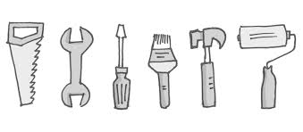
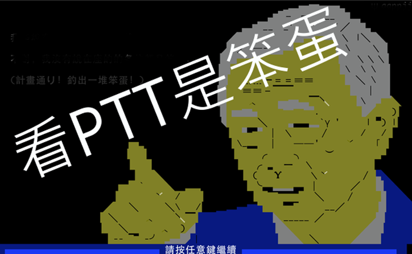
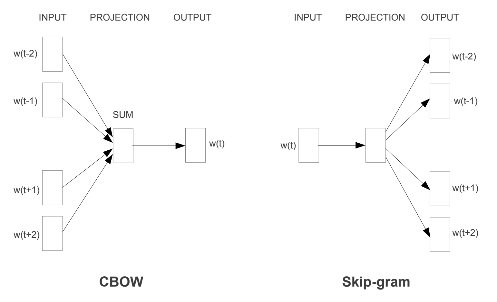

autoscale: true
footer: © leoluyi, 2018
slidenumbers: true

# Text Mining and Data Viz

### 2018-05-12 [leoluyi](https://leoluyi.github.io)@iii

### Slides [_`http://pcse.pw/6WHWJ`_](http://pcse.pw/6WHWJ)

---

## 關於我

- 呂奕 [Leo Lu](https://leoluyi.github.io)
- 台大工管
- 目前於金融業服務
- Build data products
    - ETL
    - Models
    - Text mining
    - Viz
    - ...

---

# Text Minning

## _流程_ 與 _工具們_

---

## 舊時代的工具  vs.<br\>新世代的工具

--- 

## 以前我們都用_外國人_寫的東西

## `tm` + `tmcn` `Rwordseg`

---

### 但是這些套件往往在_中文_
# 會有未知的雷

---

## 今天我們要用一些新的_工具_

---

## 流程

### Get data ➜ Tokenize ➜ Embedding ➜ Viz ➜ Model

---

## *PTT* 是宅宅的好朋友

[.footer: _Get data_ ➜ Tokenize ➜ Embedding ➜ Viz ➜ Model]

---

## 每天都有很多很多的~~廢文~~語料

---

## 自己的爬蟲自己寫

### `devtools::install_packages("leoluyi/PTTr")`

---

# Get data

[.footer: _Get data_ ➜ Tokenize ➜ Embedding ➜ Viz ➜ Model]

---

# Tokenize

## Transform whole text into parts (of distributions)

[.footer: Get data ➜ _Tokenize_ ➜ Embedding ➜ Viz ➜ Model]

---

## For English

- normalization
    - stemming (詞幹提取)
    - lemmatization (詞型還原)
- POS tagging
- ...

[.footer: Get data ➜ _Tokenize_ ➜ Embedding ➜ Viz ➜ Model]

---

## 中文似乎比較簡單

- 斷詞
- 不斷詞
- POS tagging
- ...

[.footer: Get data ➜ _Tokenize_ ➜ Embedding ➜ Viz ➜ Model]

---

## R tools

- `stringr`
- `jiebaR`

[.footer: Get data ➜ _Tokenize_ ➜ Embedding ➜ Viz ➜ Model]

---

# Embedding
## (Encode, Feature Extraction)

[.footer: Get data ➜ Tokenize ➜ _Embedding_ ➜ Viz ➜ Model]

---

## Embedding

> In a nutshell, Word Embedding turns _text_ into _numbers_.

- Embedding Layer[^1]
- Word2Vec
- GloVe
- doc2vec
- [sense2vec](https://explosion.ai/demos/sense2vec)

[^1]: https://machinelearningmastery.com/what-are-word-embeddings/

[.footer: Get data ➜ Tokenize ➜ _Embedding_ ➜ Viz ➜ Model]

---

---

## Demo

### Information Retrieval

[.footer: Get data ➜ Tokenize ➜ _Embedding_ ➜ Viz ➜ Model]

---

# Visualize

- Dimension Reduction
    - t-sne
    - PCA
- Clustering
- Interactive or static plots

[.footer: Get data ➜ Tokenize ➜ Embedding ➜ _Viz_ ➜ Model]

---

# Visualize

- `tsne::tsne()`
- `prcomp()`

[.footer: Get data ➜ Tokenize ➜ Embedding ➜ _Viz_ ➜ Model]

---

# Model

[.footer: Get data ➜ Tokenize ➜ Embedding ➜ Viz ➜ _Model_]

---

## Tasks

- Classification
    - 文本分類
- Clustering
    - 找尋相似文本
- Generative models
    - 文本自動生成

[.footer: Get data ➜ Tokenize ➜ Embedding ➜ Viz ➜ _Model_]

---

## 用到最後都會想要寫自己的 toolkit

- Sparse Matrix manipulation
- Informaiton retrieval tools
- ...

---

# _數據科學_

### 呂奕 leoluyi@github
#### https://leoluyi.github.io

